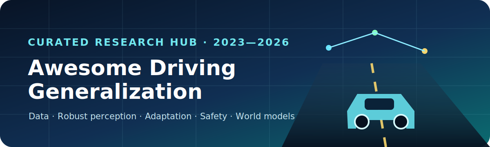

  
  
  
  
  

<h3 align="center">A living research hub for generalization, adaptation, and robustness in autonomous-driving perception.</h3>

This repository accompanies the survey **“Generalization and Adaptation in Real-World Autonomous Driving Perception”**. Its 100-paper catalog turns the paper taxonomy into a maintained, machine-readable collection of recent papers, datasets, benchmarks, metrics, and open-source projects.

> **Scope.** We prioritize work that explicitly studies distribution shift, long-tail coverage, robust perception, safe adaptation, or evaluation beyond clean-benchmark accuracy. The catalog is curated rather than exhaustive.

## Research map

## 2026 spotlight

| Theme | Paper | Venue | Why it matters |
|---|---|---:|---|
| Open-world perception | [Open-Vocabulary Domain Generalization in Urban-Scene Segmentation](https://openaccess.thecvf.com/content/CVPR2026/html/Zhao_Open-Vocabulary_Domain_Generalization_in_Urban-Scene_Segmentation_CVPR_2026_paper.html) | CVPR 2026 | Jointly tests unseen domains and unseen categories. |
| Test-time adaptation | [CD-Buffer](https://openaccess.thecvf.com/content/CVPR2026/html/Song_CD-Buffer_Complementary_Dual-Buffer_Framework_for_Test-Time_Adaptation_in_Adverse_Weather_CVPR_2026_paper.html) | CVPR 2026 | Selects additive or subtractive adaptation by shift severity. |
| Label-free pretraining | [Learning to Drive is a Free Gift](https://openaccess.thecvf.com/content/CVPR2026/html/Strong_Learning_to_Drive_is_a_Free_Gift_Large-Scale_Label-Free_Autonomy_CVPR_2026_paper.html) | CVPR 2026 | Learns geometry- and motion-aware features from unposed web videos. |
| Rare-scene generation | [DrivePTS](https://openaccess.thecvf.com/content/CVPR2026/html/Wang_DrivePTS_A_Progressive_Learning_Framework_with_Textual_and_Structural_Enhancement_CVPR_2026_paper.html) | CVPR 2026 | Improves controllability and rare-scene synthesis. |
| Physics-aware world model | [GenieDrive](https://openaccess.thecvf.com/content/CVPR2026/html/Yang_GenieDrive_Towards_Physics-Aware_Driving_World_Model_with_4D_Occupancy_Guided_CVPR_2026_paper.html) | CVPR 2026 | Uses 4D occupancy as a physical prior for video generation. |
| Planning-coupled world model | [DriveLaW](https://openaccess.thecvf.com/content/CVPR2026/html/Xia_DriveLaW_Unifying_Planning_and_Video_Generation_in_a_Latent_Driving_CVPR_2026_paper.html) | CVPR 2026 | Connects future generation and motion planning through shared latents. |

## Browse the hub

| Collection | What you will find |
|---|---|
| [Paper library](papers/README.md) | Curated 2023–2026 papers grouped by data, representation, training, adaptation, evaluation, and world models. |
| [Dataset atlas](datasets/README.md) | Sensor suites, conditions, tasks, scale, and generalization axes for recent driving datasets. |
| [Benchmark guide](benchmarks/README.md) | KITTI-C, Robo3D, RCP-Bench, planning-aware metrics, closed-loop evaluation, and reporting recommendations. |
| [`papers.csv`](data/papers.csv) | Machine-readable paper metadata for filtering or downstream analysis. |
| [`datasets.csv`](data/datasets.csv) | Machine-readable dataset metadata. |

## Recommended reading paths

<b>I work on robust camera/LiDAR perception</b>

Start with KITTI-C and Robo3D, then read JarvisIR, DUO, CodeMerge, CD-Buffer, and RCP-Bench. Compare clean accuracy, corruption retention, calibration, and recovery after the shift disappears.

<b>I work on foundation models or open-world driving</b>

Start with Open-Vocabulary DG, label-free autonomy pretraining, STSBench, and Impromptu VLA. Track both semantic novelty and geographic/weather transfer; zero-shot recognition alone is not domain generalization.

<b>I work on generation or world models</b>

Start with UniScene and DrivePTS for data generation, then DIO, GaussianWorld, GenieDrive, GaussianDWM, and DriveLaW for predictive modeling. Evaluate physics adherence and action consistency, not only FID/FVD.

## What makes an evaluation convincing?

- Report **clean accuracy and shifted accuracy** together.
- Separate weather, sensor, geography, semantic novelty, and temporal shift.
- Include **retention/degradation**, calibration, and worst-group results.
- For online adaptation, report recovery, forgetting, latency, memory, and failure safeguards.
- For world models, include physical consistency, controllability, horizon-wise calibration, and downstream closed-loop utility.

## Maintenance policy

- New releases are reviewed monthly; top-venue papers and benchmark updates receive priority.
- Entries must have a stable paper page and a clear connection to real-world generalization.
- We distinguish **official results**, **author re-implementations**, and **third-party reproductions**.
- A validation script checks metadata integrity before merge: `python scripts/validate_catalog.py`.

## Contributing

Contributions are welcome. Please read [CONTRIBUTING.md](CONTRIBUTING.md) and use the paper-suggestion issue template. A strong submission explains the distribution shift, sensor/task setting, evaluation protocol, and why the work belongs in this collection.

## Citation

If this hub or the accompanying survey helps your research, please cite the survey using [`CITATION.cff`](CITATION.cff). Bibliographic details will be updated when the journal record becomes available.

## License and disclaimer

Repository metadata and original diagrams are released under the [MIT License](LICENSE). Paper titles, abstracts, figures, datasets, and code remain the property of their respective authors. Inclusion does not imply endorsement.
